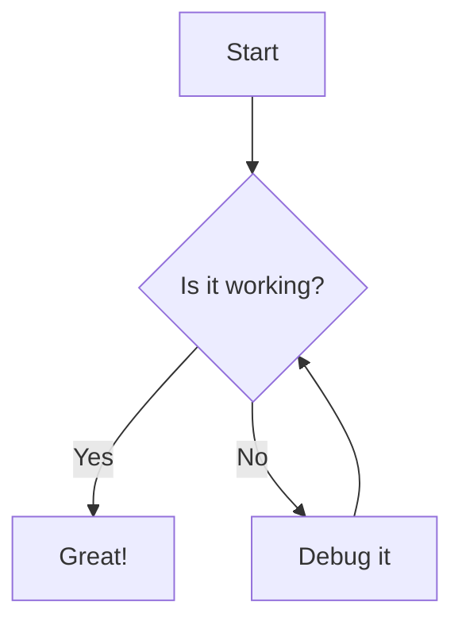

# Feature Test Document

A comprehensive sample document to test all (new) Bearpad features.

---

## Table of Contents

Jumps to location in document

- [[#Highlights]]
- [[#Footnotes]]
- [[#Block IDs]]
- [[#Task Lists]]
- [[#TOC Navigation]]

---

# Callouts

> [!note] Custom titled callout
> This is a note callout

> [!tip] You can combine ==highlights== with **bold** for emphasis.

> [!IMPORTANT] Nested callouts work too
> > [!note] Nested callout
> > This is a nested callout
> > > [!info] Nested callout
> > > This is a nested callout

---

# Highlights

You can ==highlight text== inline.

Multiple ==highlights== can appear ==in the same== paragraph.

Highlights work inside **bold** and *italic* combinations: **==bold highlight==** and *==italic highlight==*.

They do not apply inside code: `==this should not highlight==`

---

# Footnotes

Standard footnote reference[^standard] and another one[^second].

Inline footnotes work like this: the answer is 42^[This is a classic reference to The Hitchhiker's Guide to the Galaxy by Douglas Adams.] defined inline.

You can also mix them: Einstein's famous equation^[E=mc², proposed in 1905] changed everything, building on prior work[^prior].

[^standard]: This is the standard footnote definition, appearing at the bottom of the document.
[^second]: A second footnote with **bold** text and even a [link](https://example.com).
[^prior]: Maxwell's equations and earlier electromagnetic theory.

---

# Block IDs

This paragraph can be jumped to from a TOC link or an internal `[[#important]]` link. ^important

Long note name with alias — this demonstrates that the block ID is separate from display. ^todo

A third paragraph with its own anchor you can reference from the TOC. ^third-anchor

Internal links: [[#important]] jumps to the first paragraph above.

---

# Task Lists

## Basic Tasks

- [ ] Buy groceries
- [x] Write feature test document
- [ ] Review pull requests
- [x] Ship it

## Nested Tasks

- [x] Project Alpha
  - [x] Initial research
  - [x] Write spec
  - [ ] Implementation
- [x] Project Beta
  - [x] Design
  - [x] Code review

## Tasks with rich content

- [x] Read ==highlighted== text in task items
- [x] Browse footnotes[^taskfn] while working
- [x] Navigate via **block IDs** in the TOC

[^taskfn]: Footnotes work inside task descriptions too.

---

# TOC Navigation

## Level Two Heading

Some content under a level 2 heading.

### Level Three Heading

Content under level 3.

#### Level Four Heading

And level 4.

##### Level Five

And level 5.

---

## Code Blocks

Inline code: `let x = 42;` — `==no highlight here==`

```typescript
// syntax highlighting test
interface TocItem {
    id: string;
    text: string;
    level: number;
    isBlock: boolean;
}

function jumpTo(id: string) {
    const el = document.getElementById(id);
    el?.scrollIntoView({ behavior: 'smooth' });
}
```

```rust
// rust syntax highlighting
fn process_highlights(content: &str) -> String {
    let re = Regex::new(r"==([^=\n]+)==").unwrap();
    re.replace_all(content, "<mark>$1</mark>").to_string()
}
```

---

## Tables

| Feature | Syntax | Status |
|---|---|---|
| Highlights | `==text==` | ✅ |
| Inline footnotes | `^[text]` | ✅ |
| Standard footnotes | `[^ref]` | ✅ |
| Block IDs | `^id` | ✅ |
| Task toggle | `- [ ]` click | ✅ |
| Wikilinks | `[[#heading]]` | ✅ |

---

## Inline Formatting

Plain text, **bold**, *italic*, ***bold italic***, ~~strikethrough~~, ==highlight==, `inline code`, and^[a quick inline footnote].

Superscript: x^2 (not supported inline) vs actual footnote^[this is a footnote].

---

## Images and Links

A regular link: [GitHub](https://github.com)

An image:


---

## Nested Lists

1. First ordered item
2. Second item
   - Nested bullet
   - Another nested
     - Deeply nested
3. Back to top level

---

## Horizontal Rules

Content above.

---

## Blockquotes

> A regular blockquote paragraph with some text.
> It can span multiple lines.

> Nested blockquote:
> > Inner quote
> > > Deeply nested

---

## Math (KaTeX)

Inline math: $E = mc^2$

Display math:

$$\int_0^\infty e^{-x^2} dx = \frac{\sqrt{\pi}}{2}$$

---

## Mermaid Diagram


